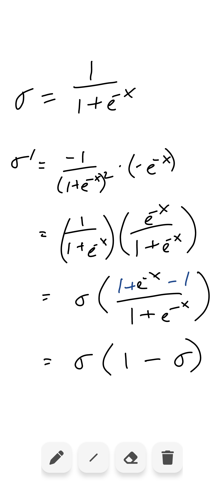
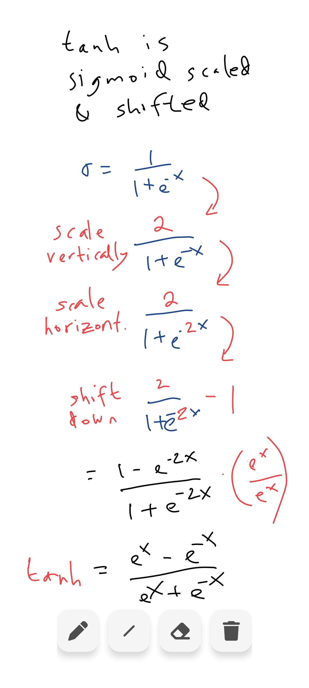
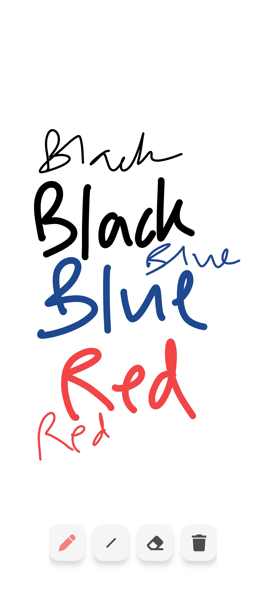

# Scratch Pad

Scratch Pad is a simple whiteboard app. You can use it like you would scratch paper.

## Features
* Full screen, zero ads
* Pan and zoom using two fingers
* Quick Clear button
* Simple and minimalist

## Screenshots

## UX Considerations
* Infinite edge-to-edge canvas that expands as you pan and zoom
* Minimal, translucent action buttons
* Drawing from left/right sides won't trigger the back gesture
* Rotate between portrait/landscape modes and your drawing will rotate with you

## Motivation for app
I wanted a simple whiteboard app to work out math equations, but couldn't find one to my liking.
So I built my own.

## TODO
* Play Store link